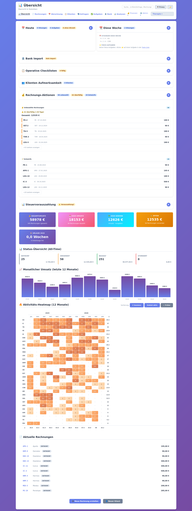
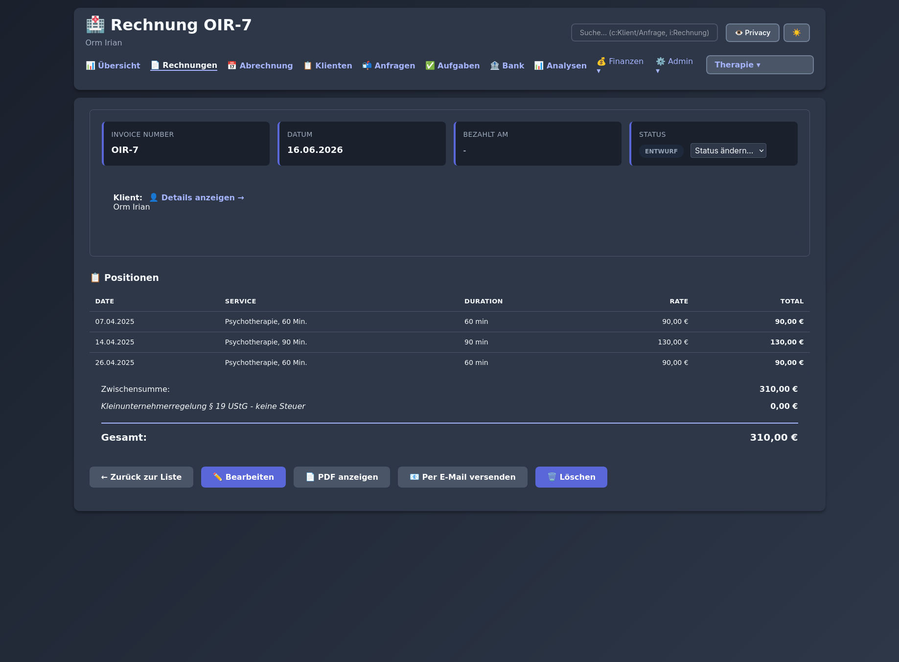
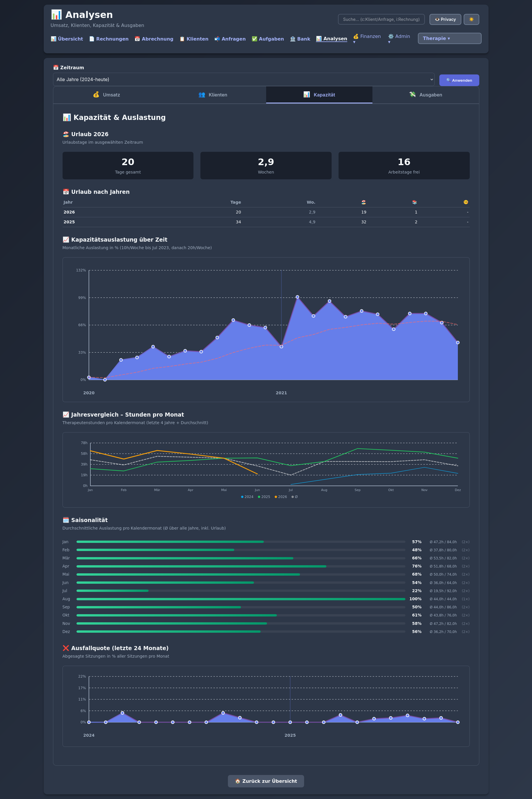
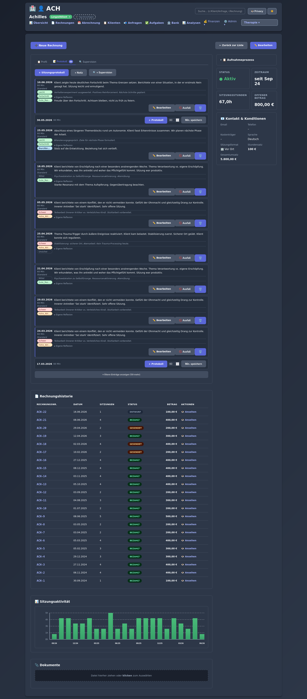
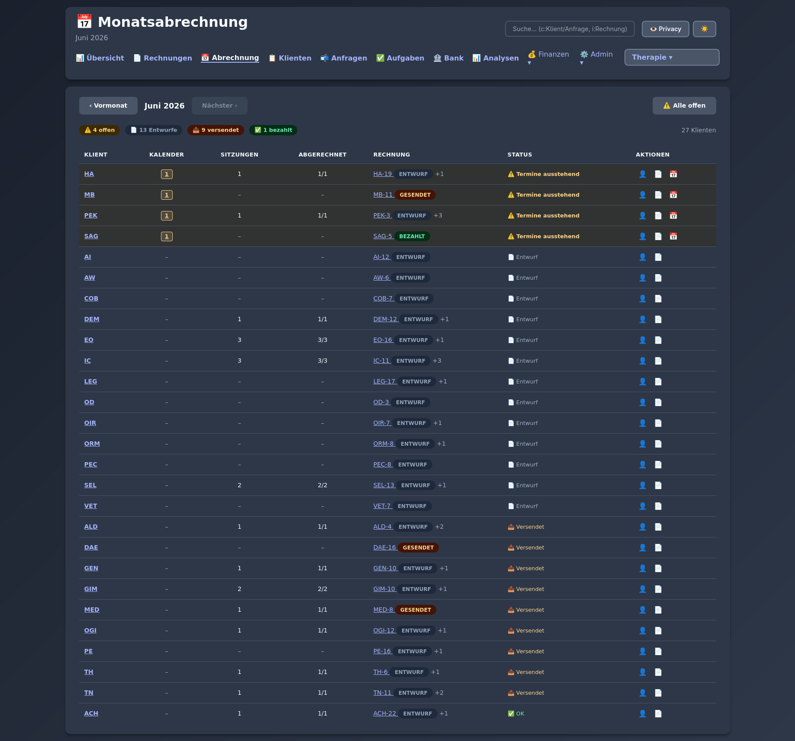

# my-practice

[](https://github.com/dholbach/my-practice/actions/workflows/ci.yml)
[](https://www.gnu.org/licenses/agpl-3.0)
[](https://www.djangoproject.com/)
[](https://www.python.org/)

**Self-hosted practice management for independent, private-pay practices** — therapy, coaching, and similar.  
Invoicing, session tracking, notes, analytics — on your own hardware, under your own control.

> **Pre-release.** The code is production-grade — 945 tests, used daily since early 2026. But it has only been tested on one setup (Germany, GLS Bank, Berlin public holidays, single practitioner). No stable API is promised and there are no support guarantees. Issues and PRs welcome.

---

## The story behind this

My practice for Body Psychotherapy and Somatic Experiencing (HPG) is in Berlin — I also offer Coaching. Over the years I'd built a collection of manual processes to run the practice: a spreadsheet for sessions and billing, another for tracking open cases, a folder of templates for invoices, calendar exports for capacity planning, a notes system for supervision preparation, separate tools for financial overviews at tax time — and a whole set of recurring todos to glue it all together.

It all *worked*, more or less. But by late 2025 the system had grown unwieldy. Each task touched multiple tools, context-switching was constant, and the mental overhead of maintaining everything was starting to feel like a second job.

In December 2025 I sat down and started over. I had Django experience from a previous career in software, so the choice of stack came naturally. What surprised me was how much building this with AI assistance taught me about modern development practices — things I'd missed in the years between my software career and my practice work. I'm glad to share that here, both the code and the approach.

The name is a little self-conscious. "my practice" isn't meant as a possessive — it's the question I kept asking myself while building: *what is my actual practice in doing this work?* What are my real workflows, what makes them feel natural, what am I doing when I sit with a client and then later sit with the paperwork?

---

## Why self-hosted?

The hard requirement, before anything else: **client data does not leave my machine.** No third-party cloud, no SaaS backend, no "encrypted in transit" hand-waving. Personal and health data (Art. 9 GDPR) stays on hardware I control, with sensitive notes encrypted at rest under a key only I hold.

Building it this way forced me to think explicitly about questions that any private practice handling personal data should be able to answer — and which off-the-shelf SaaS quietly answers *for* you, invisibly. The notes I made along the way are in the repo.

Fork it, rename it, make it yours.

---

## Not a developer? These resources are still for you

You don't need to run the app to get value from this project. Running a private practice means handling Art. 9 health data under GDPR — and most of what that requires, SaaS tools handle silently on your behalf, without you ever seeing how. Building this system meant answering those questions explicitly. The documents below are usable as standalone references:

**[DPIA template](docs/operations/DPIA-template.md)**  
When you systematically process Art. 9 health data, GDPR Art. 35 requires a Data Protection Impact Assessment before you start. Many solo practitioners don't know they need one. This is a filled-in template for a single-practitioner psychotherapy practice — adapt it to your setup and you're most of the way there.

**[Emergency access planning](docs/guides/EMERGENCY_ACCESS_PLANNING.md)**  
What happens to your clients and your data if you're suddenly unavailable — illness, accident, incapacitation? Your clients need continuity of care; your practice needs an administrative handover. This guide walks through a concrete model for solo practitioners: who can reach clients, who can access records, and what the legal boundaries are.

**[Backup and § 147 AO retention](docs/guides/BACKUP_SETUP.md)**  
German law requires keeping business records — including invoices — for ten years (§ 147 AO). That's not a technical problem; it's a compliance question every practice has to answer, regardless of what software they use. The backup guide explains the strategy used here; the questions it raises apply universally.

**[Clinical data security](docs/guides/CLINICAL_DATA_SECURITY.md)**  
Session notes and client profiles are the most sensitive data in a practice. This guide explains the two-key model used here — full-disk encryption plus a separate Fernet key for clinical content — what each layer protects against, and the questions every practitioner should be able to answer about wherever their data lives.

**[Client privacy notices](docs/operations/PRIVACY_NOTICE_CLIENTS_DE.md)**  
Ready-to-adapt privacy notices (DE + EN) for informing clients about data processing under GDPR Art. 13. Most practices need these and most don't have them written down.

**[Record of processing activities](docs/operations/DATA_REGISTER.md)**  
A Verzeichnis von Verarbeitungstätigkeiten as required under GDPR Art. 30 — the register of what data you hold, why, how long, and who has access. Filled in for a solo psychotherapy practice.

---

## Screenshots

> Screenshots taken with `./dev.py manage seed_sample_data` — all names are fictional.

### Dashboard


### Invoice detail


### Analytics


### Client detail


### Batch invoicing


---

## What it does

**Billing**
- Client management with per-client hourly rates
- Session-linked invoice items — bill directly from session records
- Batch invoicing: one screen to draft a whole month's invoices
- PDF generation (bilingual DE/EN, your logo + signature)
- Email via Proton Bridge; payment status tracking

**Sessions & clinical**
- Session log with protocol notes, therapist reflection, mood tags
- Intake questionnaire and treatment contract PDFs
- Clinical notes encrypted with Fernet (separate key from disk encryption)
- Client document upload and tagging

**Analytics**
- Revenue trends, year-over-year comparison, tax-year summary
- Capacity utilisation vs. target hours (Berlin public holidays aware)
- Client inquiry pipeline with funnel view and conversion rates

**Integrations**
- Google Calendar import — maps events to sessions, detects reschedules and cancellations
- Bank statement CSV import with auto-matching to invoices (GLS Bank semicolon-delimited format; other banks will need format adaption)
- Operational backup checklist with completion tracking

Full feature list: [docs/FEATURES.md](docs/FEATURES.md)

---

## Architecture

A conventional Django 6 monolith backed by PostgreSQL (psycopg3, async-capable), ~950 tests, no external services required beyond the database. A few non-obvious choices:

**Encrypted clinical fields**  
Session notes and sensitive client data use a custom [`EncryptedTextField`](app/my_practice/fields.py) backed by Fernet symmetric encryption (`cryptography` library). The key lives in `FERNET_KEY` (env var), separate from the LUKS full-disk-encryption key — two independent keys, two independent attack surfaces. A plain SQL `SELECT` on an encrypted column returns `gAAAAA...` ciphertext; the ORM is the only path to plaintext. Trade-off: no `.filter()`/`.exclude()` on encrypted columns — navigate clinical records by client, date, and tags instead.

**Why PostgreSQL**  
Performance indexes on the invoice/client foreign keys (migrations 0013, 0014), and psycopg3's async driver for Django's async views. The load of a single-practitioner practice doesn't require it, but it keeps the deployment realistic and the door open for async features.

**Pattern layer**  
Views stay thin by delegating to builder classes (`AnalyticsDashboardBuilder`, `FinancialListContextBuilder`) and filter helpers (`InvoiceFilterHelper`). Models, views, and utils are split into domain-focused modules under `app/my_practice/{models,views,utils}/`. The full pattern catalogue — including the builder API, CRUD mixins, and query helpers — is in [`CLAUDE.md`](CLAUDE.md). It was written as AI-assistant instructions but reads as a practical architecture reference for anyone contributing to the codebase.

---

## Quick start

### Image-based (recommended for self-hosters)

**Requirements**: Docker with the Compose plugin, Python 3.

```bash
curl -O https://raw.githubusercontent.com/dholbach/my-practice/main/docker-compose.prod.yml
curl -O https://raw.githubusercontent.com/dholbach/my-practice/main/prod.py
chmod +x prod.py
./prod.py setup
```

`setup` generates secrets, pulls the image, starts the stack, and walks you through creating a login and configuring your practice.

### Source-based (for developers)

**Requirements**: Docker with the Compose plugin, Git, Python 3 (for `dev.py`).

```bash
git clone https://github.com/dholbach/my-practice.git
cd my-practice
./dev.py start --build      # builds image, starts PostgreSQL + Django
```

App is at **http://localhost:8000**. First run:

```bash
./dev.py manage createsuperuser
./dev.py manage seed_sample_data   # optional: loads fictional demo data
```

Full walkthrough including real-use setup: [docs/guides/GETTING_STARTED.md](docs/guides/GETTING_STARTED.md)

---

## Keeping up to date

See [UPGRADING.md](UPGRADING.md) for the standard upgrade procedure and any version-specific steps.

---

## Status and limitations

- **Daily driver** — used in production for one practice since early 2026; ~945 tests
- **German UI** — the interface is in German. Full i18n via Django `` is on the roadmap — see [P-039](docs/projects/todo/P-039_I18N.md). If you'd like to help translate, PRs are very welcome.
- **One practice, one setup** — multi-practice support exists in the data model but the UX assumes a solo practitioner
- **Some parts are mine** — the backup checklist items, bank CSV parser, and treatment contract template reflect my specific setup; see [CUSTOMISATION.md](docs/guides/CUSTOMISATION.md)
- **AGPL-3.0** — Using it for your own practice: no restrictions. Offering it as a service to others: AGPL applies.

---

## Development

`dev.py` is the single entry point:

```bash
./dev.py test            # Django + JS tests
./dev.py quality         # ruff format, ruff lint, tests
./dev.py shell           # Django shell
./dev.py logs -f         # follow container logs
./dev.py restart --force # full restart (reloads .env)
```

Reference: `./dev.py --help` or [docs/operations/SCRIPTS.md](docs/operations/SCRIPTS.md)

---

## Documentation

| | |
|---|---|
| [UPGRADING.md](UPGRADING.md) | Upgrade procedure and breaking-change notes |
| [GETTING_STARTED.md](docs/guides/GETTING_STARTED.md) | First-run walkthrough |
| [FEATURES.md](docs/FEATURES.md) | Full feature list |
| [CUSTOMISATION.md](docs/guides/CUSTOMISATION.md) | What to replace before using for your own practice |
| [BACKUP_SETUP.md](docs/guides/BACKUP_SETUP.md) | Backup and restore |
| [EMERGENCY_ACCESS_PLANNING.md](docs/guides/EMERGENCY_ACCESS_PLANNING.md) | What happens to the data if you're unavailable |
| [CLINICAL_DATA_SECURITY.md](docs/guides/CLINICAL_DATA_SECURITY.md) | How sensitive data is encrypted at rest |
| [SECURITY.md](docs/operations/SECURITY.md) | Security model and deployment notes |
| [DPIA-template.md](docs/operations/DPIA-template.md) | Data protection impact assessment template |
| [CODE_STRUCTURE.md](docs/architecture/CODE_STRUCTURE.md) | Codebase patterns |
| [CLAUDE.md](CLAUDE.md) | Builder classes, view mixins, query helpers — AI instructions that double as an architecture reference |
| [PROJECTS.md](PROJECTS.md) | Roadmap and backlog |

---

## License

[GNU Affero General Public License v3.0](LICENSE) (AGPL-3.0)

Copyright (C) 2026 Daniel Holbach
