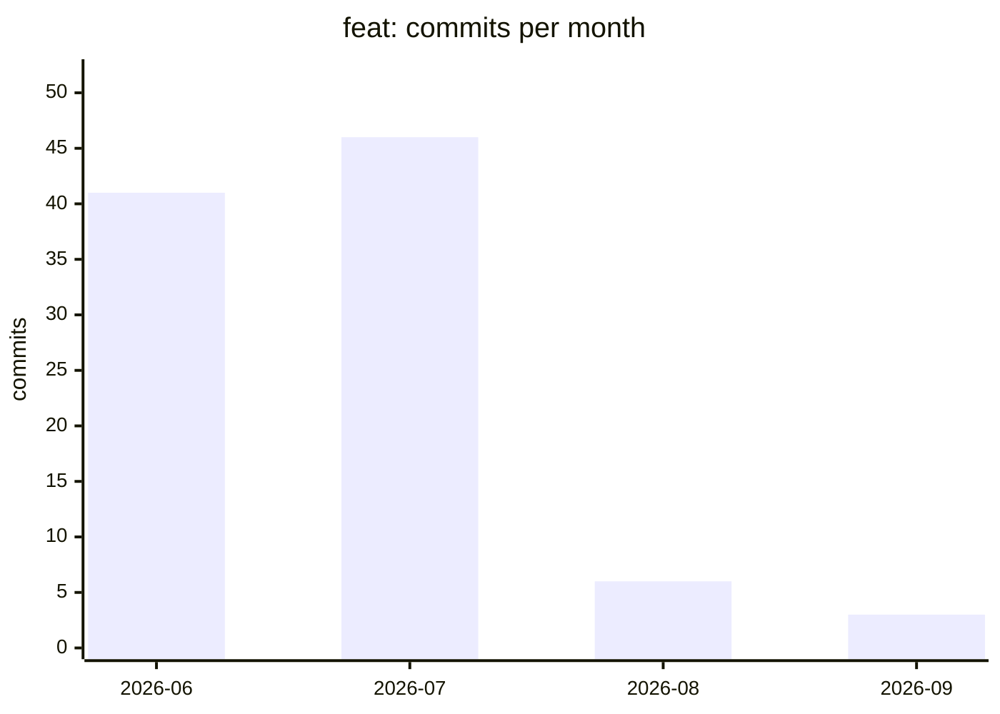
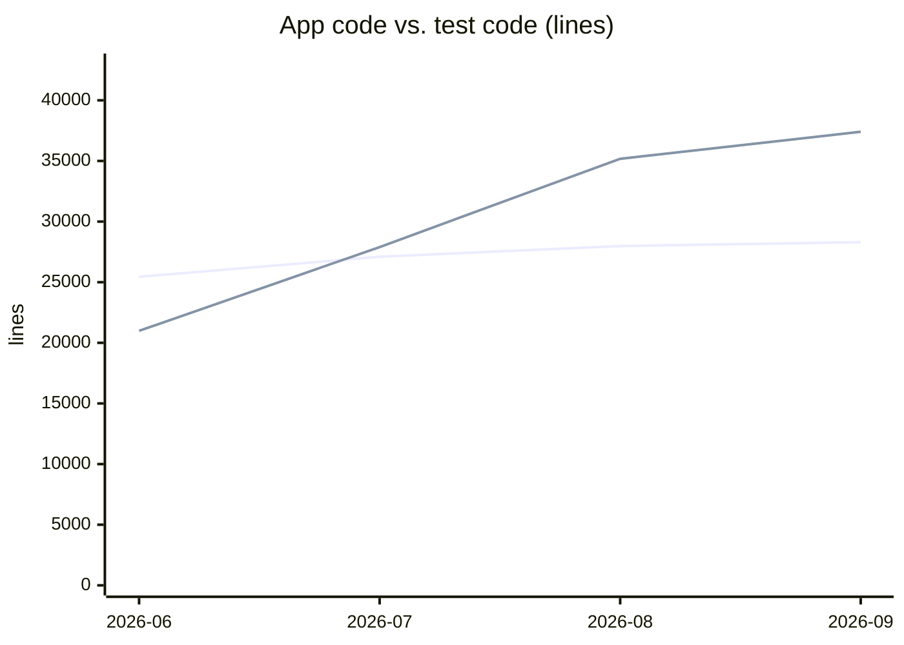

# Codebase development metrics

Generated by [`scripts/codebase_metrics.py`](../../scripts/codebase_metrics.py) — do not edit by hand. Refresh with `scripts/codebase_metrics.py`; a scheduled workflow also opens a refresh branch on the first of each month.

**Snapshot — 2026-09-15 (`ecc35ba`)**

| | |
| --- | --- |
| Tracked lines | 101,362 |
| App code | 28,300 |
| Test code | 37,405 |
| Test-to-code ratio | 1.32 : 1 |
| Releases so far | 27 |

## Is feature work still happening?

The first question to ask a maturing project. A long run of near-zero `feat:` months means maintenance has quietly become the whole job — fine if chosen, worth noticing if not.

## What is actually growing?

App code is surface area you have to hold in your head; tests are insurance. They grow for different reasons and only one of them is a warning sign.

Mermaid draws these without a legend, so: app code is the series ending at 28,300 lines, test code the one ending at 37,405.

### Lines by category

| Category | 2026-06 | 2026-07 | 2026-08 | 2026-09 | Change |
| --- | ---: | ---: | ---: | ---: | ---: |
| app | 25,445 | 27,099 | 27,985 | 28,300 | +11% |
| tests | 20,986 | 27,899 | 35,178 | 37,405 | +78% |
| templates | 12,806 | 12,617 | 12,564 | 12,645 | -1% |
| js | 2,719 | 2,617 | 2,822 | 2,721 | +0% |
| css | 2,647 | 2,641 | 2,645 | 2,878 | +9% |
| migrations | 1,029 | 3,786 | 4,389 | 4,389 | +327% |
| docs | 13,657 | 13,681 | 14,474 | 13,024 | -5% |

## Where does the effort go?

Share of classified (non-merge, conventional-commit) work per month. `feat`/`fix`/`refactor`/`perf` move the product or its structure; the rest keep the lights on.

| Month | Commits | Product work | Mix |
| --- | ---: | ---: | --- |
| 2026-06 | 166 | 54% | ██████████ |
| 2026-07 | 146 | 66% | ████████████ |
| 2026-08 | 116 | 41% | ███████ |
| 2026-09 | 41 | 50% | █████████ |

### Commits by type

| Type | 2026-06 | 2026-07 | 2026-08 | 2026-09 |
| --- | ---: | ---: | ---: | ---: |
| feat | 41 | 46 | 6 | 3 |
| fix | 40 | 33 | 30 | 13 |
| refactor | 3 | 10 | 7 | 0 |
| perf | 0 | 1 | 2 | 1 |
| test | 0 | 7 | 12 | 0 |
| docs | 15 | 8 | 7 | 3 |
| chore | 51 | 27 | 37 | 11 |
| ci | 3 | 0 | 3 | 1 |
| style | 1 | 1 | 6 | 0 |
| other | 2 | 4 | 1 | 2 |

## Releases

| Month | Count | Tags |
| --- | ---: | --- |
| 2026-06 | 8 | `v0.1.0`, `v0.2.0`, `v0.2.1`, `v0.2.2`, `v0.2.3`, `v0.2.4`, `v0.2.5`, `v0.2.6` |
| 2026-07 | 9 | `v0.2.7`, `v0.2.8`, `v0.2.9`, `v0.2.10`, `v0.2.11`, `v0.2.12`, `v0.3.0`, `v0.4.0`, `v0.4.1` |
| 2026-08 | 7 | `v0.4.2`, `v0.4.3`, `v0.5.0`, `v0.5.1`, `v0.5.2`, `v0.5.3`, `v0.5.4` |
| 2026-09 | 3 | `v0.5.5`, `v0.6.0`, `v0.6.1` |
