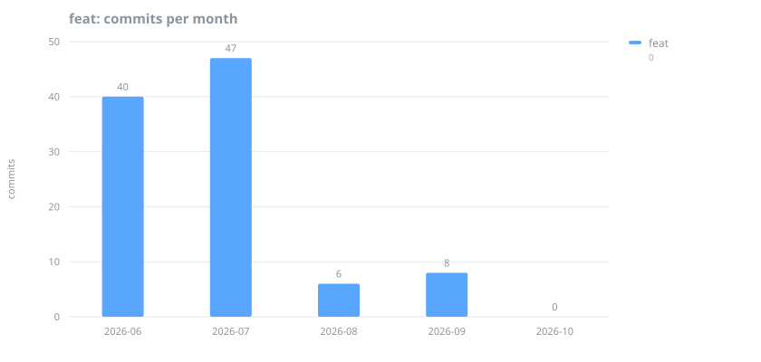
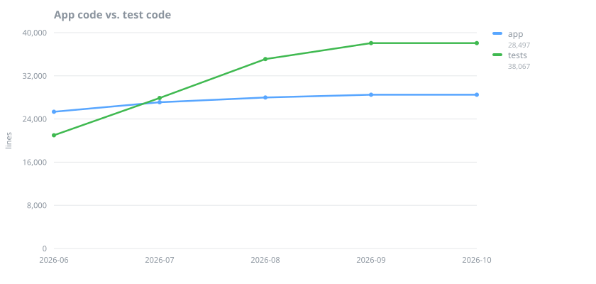
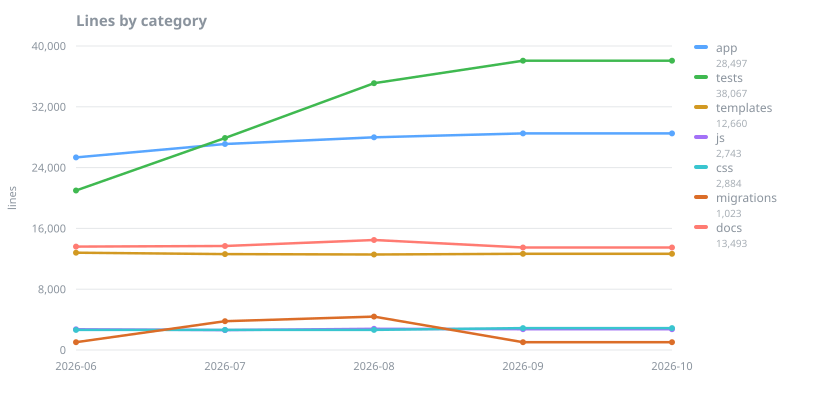
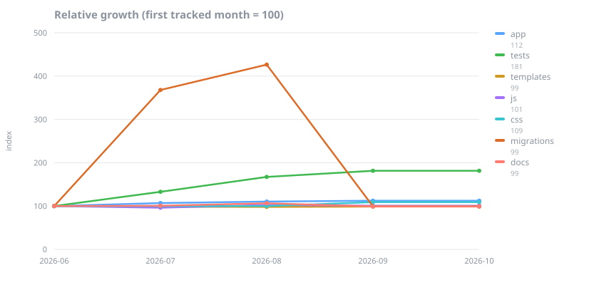
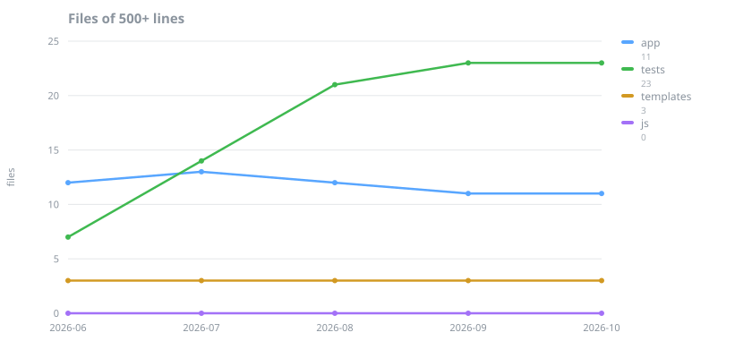

# Codebase development metrics

Generated by [`scripts/codebase_metrics.py`](../../scripts/codebase_metrics.py) — do not edit by hand. Refresh with `scripts/codebase_metrics.py`; a scheduled workflow also pushes a refresh branch on the first of each month.

**Snapshot — 2026-10-01 (`7663d33`)**

| | |
| --- | --- |
| Tracked lines | 99,367 |
| App code | 28,497 |
| Test code | 38,067 |
| Test-to-code ratio | 1.34 : 1 |
| Releases so far | 29 |

## Is feature work still happening?

The first question to ask a maturing project. A long run of near-zero `feat:` months means maintenance has quietly become the whole job — fine if chosen, worth noticing if not.

## What is actually growing?

App code is surface area you have to hold in your head; tests are insurance. They grow for different reasons and only one of them is a warning sign.

### Lines by category

The same series indexed to their first tracked month, which separates the categories the chart above stacks onto the baseline. Anything flat along the dashed line is holding steady; docs below it are shrinking.

| Category | 2026-06 | 2026-07 | 2026-08 | 2026-09 | 2026-10 | Change |
| --- | ---: | ---: | ---: | ---: | ---: | ---: |
| app | 25,347 | 27,099 | 27,981 | 28,497 | 28,497 | +12% |
| tests | 20,985 | 27,899 | 35,111 | 38,067 | 38,067 | +81% |
| templates | 12,807 | 12,617 | 12,564 | 12,660 | 12,660 | -1% |
| js | 2,719 | 2,617 | 2,788 | 2,743 | 2,743 | +1% |
| css | 2,646 | 2,641 | 2,645 | 2,884 | 2,884 | +9% |
| migrations | 1,029 | 3,786 | 4,389 | 1,023 | 1,023 | -1% |
| docs | 13,601 | 13,681 | 14,474 | 13,493 | 13,493 | -1% |

## Is growth spread out, or piling up?

Total lines can rise harmlessly while one module quietly becomes the place every new feature gets bolted onto. The count of files past 500 lines is the figure to keep flat; the largest-file list below is where to start when it is not. Test files are held to the same bar — a long test module is as hard to navigate as a long view, it just fails less loudly.

| Category | Files | Median | p90 | Largest | 500+ lines | Change |
| --- | ---: | ---: | ---: | ---: | ---: | ---: |
| app | 127 | 173 | 454 | 950 | 11 | -8% |
| tests | 110 | 315 | 638 | 975 | 23 | +229% |
| templates | 92 | 84 | 279 | 1,083 | 3 | +0% |
| js | 19 | 116 | 339 | 378 | 0 | — |

*Change* is the movement in the long-file count across the tracked window.

### Longest files right now

| Lines | File | Category |
| ---: | --- | --- |
| 1,083 | [`app/templates/my_practice/analytics.html`](../../app/templates/my_practice/analytics.html) | templates |
| 975 | [`app/my_practice/tests/test_views_client.py`](../../app/my_practice/tests/test_views_client.py) | tests |
| 950 | [`app/my_practice/management/commands/seed_sample_data.py`](../../app/my_practice/management/commands/seed_sample_data.py) | app |
| 904 | [`app/my_practice/tests/test_fetch_calendar_events.py`](../../app/my_practice/tests/test_fetch_calendar_events.py) | tests |
| 874 | [`app/my_practice/tests/test_clinical.py`](../../app/my_practice/tests/test_clinical.py) | tests |
| 832 | [`app/my_practice/tests/test_email_views.py`](../../app/my_practice/tests/test_email_views.py) | tests |
| 813 | [`app/static/js/command_palette.test.js`](../../app/static/js/command_palette.test.js) | tests |
| 785 | [`app/templates/my_practice/client_detail.html`](../../app/templates/my_practice/client_detail.html) | templates |
| 784 | [`app/my_practice/tests/test_models.py`](../../app/my_practice/tests/test_models.py) | tests |
| 783 | [`app/my_practice/views/bank_import_views.py`](../../app/my_practice/views/bank_import_views.py) | app |
| 765 | [`app/my_practice/tests/test_google_calendar.py`](../../app/my_practice/tests/test_google_calendar.py) | tests |
| 717 | [`app/my_practice/views/email_views.py`](../../app/my_practice/views/email_views.py) | app |

## Where does the effort go?

Share of classified (non-merge, conventional-commit) work per month. `feat`/`fix`/`refactor`/`perf` move the product or its structure; the rest keep the lights on.

| Month | Commits | Product work | Mix |
| --- | ---: | ---: | --- |
| 2026-06 | 158 | 53% | █████████ |
| 2026-07 | 154 | 66% | ████████████ |
| 2026-08 | 114 | 41% | ███████ |
| 2026-09 | 95 | 45% | ████████ |
| 2026-10 | 0 | 0% |  |

### Commits by type

| Type | 2026-06 | 2026-07 | 2026-08 | 2026-09 | 2026-10 |
| --- | ---: | ---: | ---: | ---: | ---: |
| feat | 40 | 47 | 6 | 8 | 0 |
| fix | 36 | 37 | 30 | 26 | 0 |
| refactor | 2 | 11 | 7 | 4 | 0 |
| perf | 0 | 1 | 2 | 1 | 0 |
| test | 0 | 7 | 12 | 2 | 0 |
| docs | 15 | 8 | 7 | 7 | 0 |
| chore | 49 | 29 | 37 | 32 | 0 |
| ci | 3 | 0 | 3 | 4 | 0 |
| style | 1 | 1 | 6 | 0 | 0 |
| other | 2 | 4 | 1 | 2 | 0 |

## Releases

| Month | Count | Tags |
| --- | ---: | --- |
| 2026-06 | 8 | `v0.1.0`, `v0.2.0`, `v0.2.1`, `v0.2.2`, `v0.2.3`, `v0.2.4`, `v0.2.5`, `v0.2.6` |
| 2026-07 | 9 | `v0.2.7`, `v0.2.8`, `v0.2.9`, `v0.2.10`, `v0.2.11`, `v0.2.12`, `v0.3.0`, `v0.4.0`, `v0.4.1` |
| 2026-08 | 7 | `v0.4.2`, `v0.4.3`, `v0.5.0`, `v0.5.1`, `v0.5.2`, `v0.5.3`, `v0.5.4` |
| 2026-09 | 5 | `v0.5.5`, `v0.6.0`, `v0.6.1`, `v0.7.0`, `v0.7.1` |
| 2026-10 | 0 | — |
